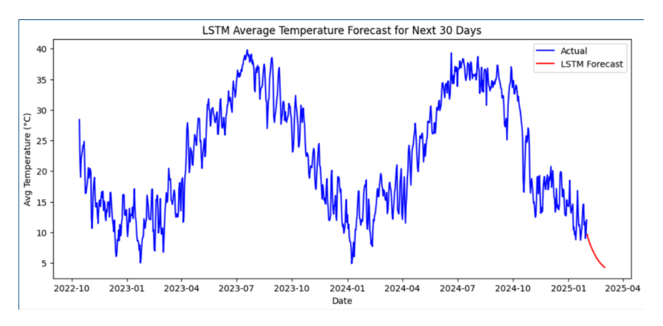
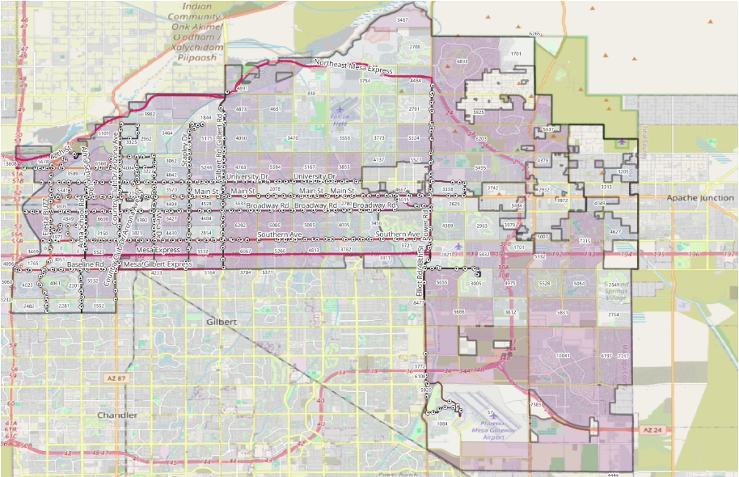
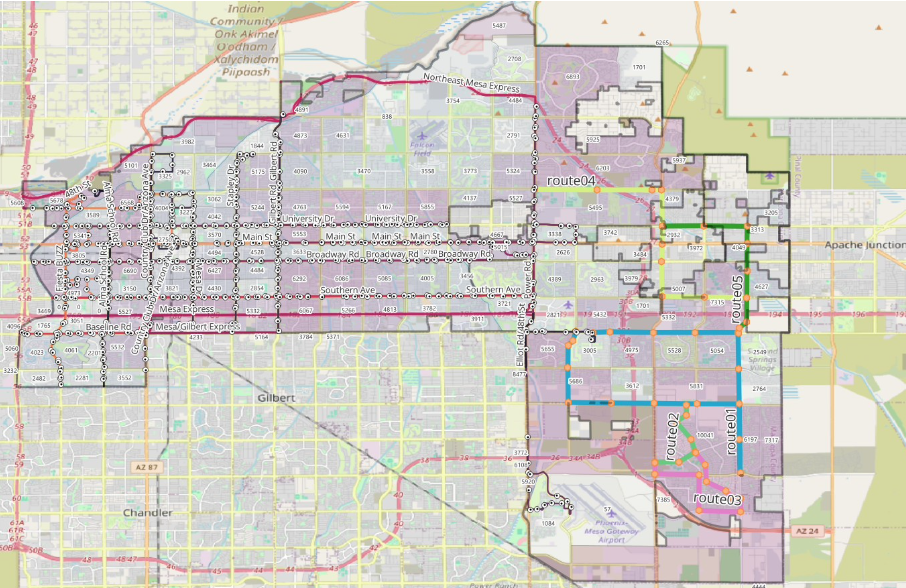
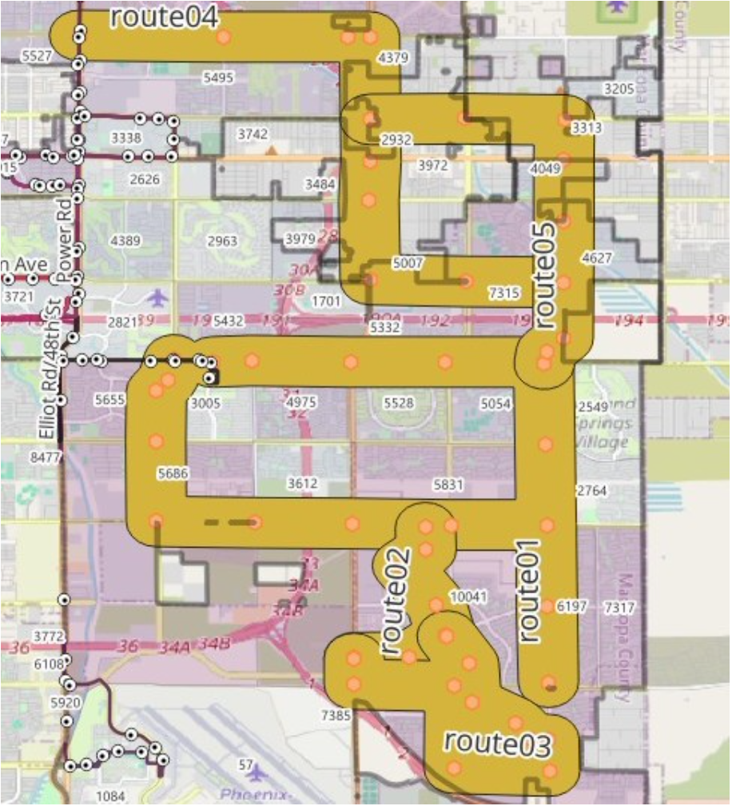
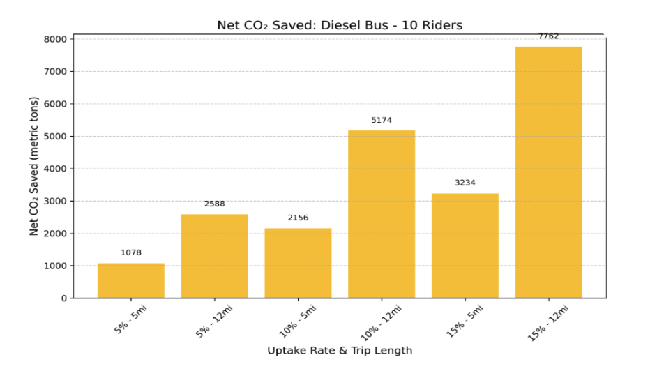
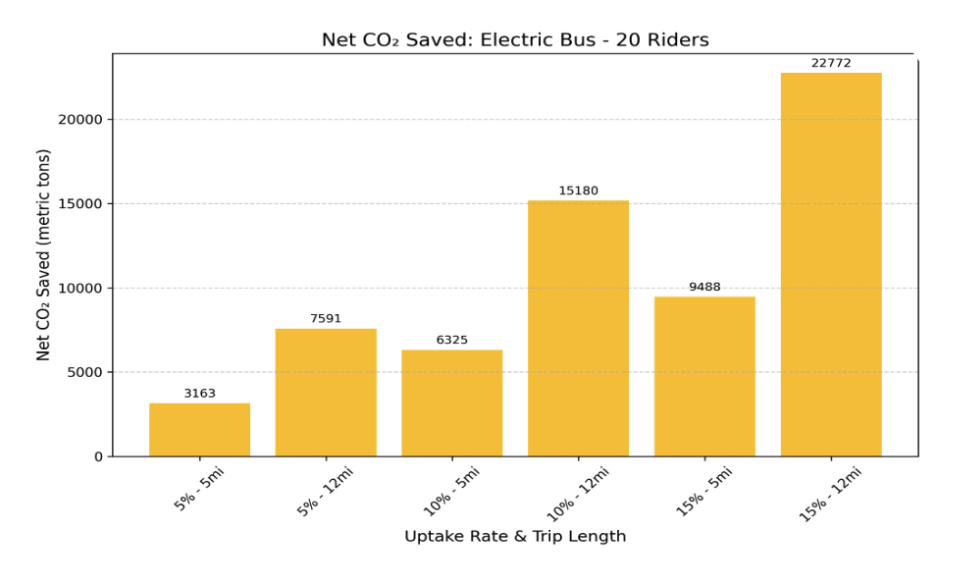

> **TL;DR**- a thorough plan and execution to combat rising carbon emissions in a city using QGIS for geospatial modeling, analyzing public transit and personal vehicle usage trends, forecasting short term and long term changes in temperature, and proposing new bus routes in underserved areas by estimating the population impacted and financial analysis. All data collected was publicly available through the city of Mesa's website, Valley Metro's budget reports, and open source weather APIs. Tools Used- Python, Pandas, NumPy scikit-learn, TensorFlow, matplotlib, QGIS 3.4, Microsoft Excel, Open-Meteo, and more.

---

## Problem

Phoenix, AZ already struggles with intense heat in the summer and poor air quality. Population and economic growth in the metropolitan area only adds to these issues which puts vulnerable people such as the elderly, homeless, and low income households at high risk. In this project I collaborated with Tanmay Singh at Arizona State to address some of the problems that climate change has been posing in Mesa, AZ. Public transportation can be a practical and scalable segue from a carbon heavy city to working towards a carbon free city. To do this we conducted a comprehensive of the city's infrastructure and public expenditures with the goal of filling the service gaps and proposing expansion strategies that are sustainable.

## Forecasting Temperature Trends

I used LSTM and ARIMA models to forecast temperatures using historical data from Open-Meteo for over 10 years. LSTM was rather easy as I have plenty of experience with it. 2 layers, 100 units, and Adam optimizer trained for 20 epochs was the optimal configuration. For ARIMA I used autoregressive elements instead of moving averages as the change in data wasn't significant enough for it to be useful. Low MSE and RMSE again (both < 0.38) and plotted the 5 year forecast using Matplotlib. This meant a less than 0.4 C deviation in my forecast from the actual temperatures. The forecast also projects an increase in about 0.5 F by 2025.

---

## Geospatial Analysis

GIS was the major task of this project. Using Valley Metro's pubic data I visualized the bus usage over the last 12 years. Clearly the ridership declined drastically in 2020, likely due to Covid-19 (283k riders in Feb 2020 to just 154k in April 2020). Nonetheless the usage never returned to its pre pandemic levels. By my analysis this is due to a mix of the pandemic, remote work, and higher unemployment than pre 2020.

QGIS 3.4 was the tool we used for spatial analysis and Excel for preprocessing demographic data. Joined population estimated to tract shapefile using the GEOID key to visualize population densit. Then we isolated the tracts with no overlapping service and put them in a different layer to clearly showcase the service gaps. In the image below each blue block shows its population. It is evident that the eastern part of Mesa is heavily underserviced, especially for a region with high population.

Finally another layer to map 6 new bus routes that not only served underserved areas but also avoided redundant coverage to maximize efficiency. Each route also included multiple bus stops as vertices. In the image below the new proposed routes are colored in blue, light green, pink, yellow, and dark green.

---

## Proposing Bus Routes and Walkability Analysis

We also used QGIS' buffer tool to create a walkability buffer (people may want to walk to the bus stop) of 500m. This was a reasonable 5 min walk. After zeroing in on meaningful tracks by analyzing the area covered we estimated over 63,000 people gaining access to public transit within walking distance.

---

## Financial Feasibility

Obviously all this would be meaningless without its financial considerations so we used the city's budget and Valley Metro's budget reports. This fiscal year allocated a $158 million budget but a mere $2.7M for personnel and $100k for site improvements which combined is < 2% of the budget. This was seen in the fact that many pass readers were not functional which meant Valley Metro was losing money already. Also, by their estimates, a bus shelter with basic amenities costs $12k which when combined with our 45 new stops would equal $540k in total. Since Valley Metro is partially funded by the government, less a mere 0.15% of the city's budget reallocation from foreign aid would cover this.

---

## Environmental Impact

Finally, and the essence of this project, the environmental impact. Assuming America's national averages of 250 work days a year, 12 mile trip to work and 12 miles back, average occupany of 10 on buses, and carbon emissions of diesel and electric buses, the proposal estimates almost 8k tonnes of carbon emissions saved if just 15% of the affected 63k+ people took a diesel bus to and from work. This number goes as high as over 22k tonnes saved in case of an electric bus. Assuming an 8k tonne average, this is equivalent to eliminating over 20 million miles driven by gas powered cars, or planting over 400k trees, or 900k gallons of gas burned.

